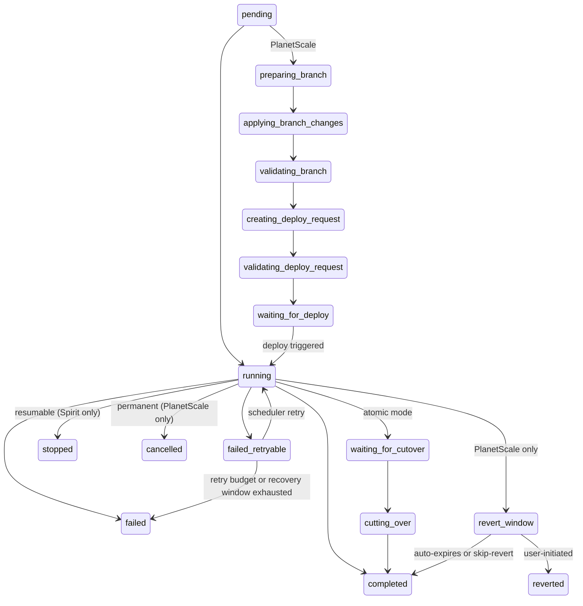
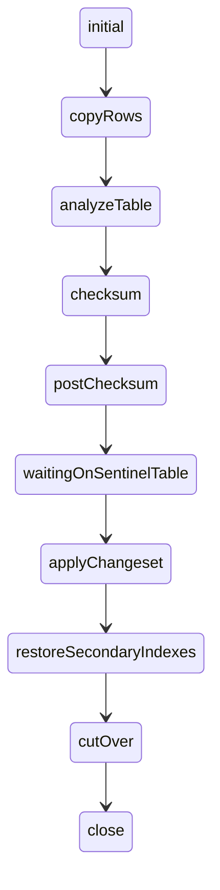
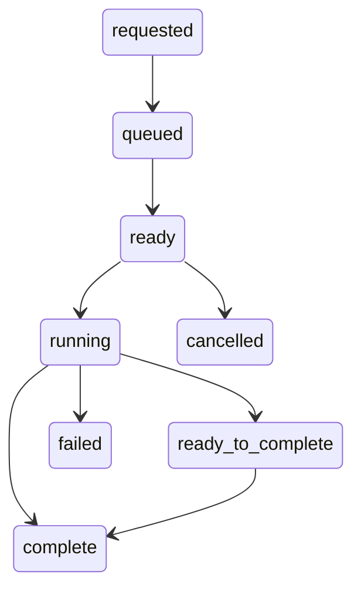

# pkg/state

Canonical state constants for SchemaBot.

## State hierarchy

```
Apply (1) ──→ Tasks (many) ──→ Engine reports per table/shard
state.Apply     state.Task       vitess schema / spirit status
```

An apply includes one or more tasks, where a task tracks the execution of a single table. Both `Apply` and `Task` are
SchemaBot's internal states (stored in DB) that operate in a state machine. Engine states are external — what
Vitess OnlineDDL and Spirit report — and they are translated into Task state before Apply state is derived from
the stored task rows.

## Apply states

| State | Value | Description |
|-------|-------|-------------|
| Pending | `pending` | Apply created, no tasks started |
| Running | `running` | At least one task is actively executing |
| ValidatingBranch | `validating_branch` | Branch schema validation in progress after DDL apply (PlanetScale only) |
| ValidatingDeployRequest | `validating_deploy_request` | PlanetScale is validating the deploy request diff (PlanetScale only) |
| WaitingForDeploy | `waiting_for_deploy` | Deploy request ready, waiting for user to trigger deploy (PlanetScale only). Without `--defer-deploy`, auto-advances immediately. |
| WaitingForCutover | `waiting_for_cutover` | All tasks ready, waiting for manual cutover (atomic mode only — in sequential mode each task cuts over independently) |
| CuttingOver | `cutting_over` | Cutover in progress (atomic mode only) |
| Completed | `completed` | All tasks finished successfully |
| Failed | `failed` | At least one task failed |
| FailedRetryable | `failed_retryable` | A retryable engine error occurred; scheduler recovery can retry it |
| Stopped | `stopped` | User requested stop, resumable via start (engine-dependent) |
| Cancelled | `cancelled` | Apply was cancelled and is not resumable |
| RevertWindow | `revert_window` | Schema change applied, revert available. Only meaningful for PlanetScale; Spirit doesn't support revert so SchemaBot auto-advances to completed |
| Reverted | `reverted` | Schema change was reverted |



- `waiting_for_deploy`: PlanetScale only. The deploy request is created and ready, but not yet executed. With `--defer-deploy`, the user reviews the deploy request diff on PlanetScale and triggers via `schemabot cutover`. Without `--defer-deploy`, the system auto-advances through this state. For instant DDL, the deploy completes immediately after triggering. `--defer-deploy` and `--defer-cutover` compose: the first pauses before deploy, the second pauses before cutover.
- `waiting_for_cutover`/`cutting_over`: Only with `--defer-cutover` or atomic mode (Spirit). Note: `--defer-cutover` is a no-op for instant DDL (no cutover exists).
- `revert_window`: Only with `--enable-revert`. Spirit auto-advances through it; PlanetScale holds until expiry or user action. Maps from PlanetScale's `complete_pending_revert` deploy state
- `stopped`: Spirit only — resumable via `schemabot start`. Spirit checkpoints progress for resume.
- `failed_retryable`: transient engine failure. Scheduler workers retry while the retry budget remains, then move the apply to `failed`.
- `cancelled`: PlanetScale only — permanent. Cancels the deploy request; the underlying Vitess migrations are cancelled. Not resumable — start a new apply instead.

## Task states

Per-table execution state. Mostly mirrors Apply state, with per-table scheduler/control states:

| State | Value | Description |
|-------|-------|-------------|
| Pending | `pending` | Task created, not yet started |
| Running | `running` | Engine is actively executing (row copy, checksum, etc.) |
| WaitingForDeploy | `waiting_for_deploy` | Deploy request ready, waiting for user to trigger deploy (PlanetScale only) |
| WaitingForCutover | `waiting_for_cutover` | Row copy complete, waiting for cutover signal |
| CuttingOver | `cutting_over` | Table cutover in progress |
| Completed | `completed` | Schema change applied successfully |
| Failed | `failed` | Engine reported failure |
| FailedRetryable | `failed_retryable` | Retryable engine error; reset to pending on scheduler retry |
| Stopped | `stopped` | User requested stop, checkpoint saved |
| RevertWindow | `revert_window` | Schema change applied, revert available (PlanetScale only) |
| Reverted | `reverted` | Schema change was reverted |
| Cancelled | `cancelled` | Task never executed due to earlier failure (sequential mode) |

### Retryable failure relationship

`failed_retryable` exists at both task and apply levels, but each level answers a different question:

- A **task** in `failed_retryable` means one table's work hit a retryable engine error. The task is not terminal because scheduler recovery may run that table work again.
- An **apply** in `failed_retryable` means the whole apply is paused and waiting for scheduler recovery. The apply owns the retry attempt counter and retry budget.
- A **pending task** is unfinished work that is not currently running. It remains attached to the apply and is eligible to run the next time the apply is dispatched.

The apply state rolls up from task state: any `failed_retryable` task makes the apply `failed_retryable` unless a permanent `failed` task is present. Atomic execution can also mark the apply `failed_retryable` while updating the affected tasks from the same retryable engine result.

When the scheduler claims a retryable apply, it refreshes the apply heartbeat as a lease, increments the apply attempt, and re-dispatches the apply. That attempt count is the apply-level dispatch count for the whole retry cycle; it is not a per-task counter.

The scheduler does not claim tasks directly. It claims the `failed_retryable` apply, reloads that apply's tasks, then prepares the retry by clearing only the tasks in `failed_retryable`. Those tasks move back to `pending`, their error message is cleared, and their task attempt count increments. Completed tasks are left alone because their table work already succeeded.

On retry, tasks are handled by their current state:

- `completed` tasks stay completed and are skipped.
- `failed_retryable` tasks reset to `pending` so they can run again.
- `pending` tasks remain pending and can run on the next dispatch.

For example, in sequential mode, if table A completed, table B failed retryably, and table C never started, the retry starts from B/C work. Table A is not run again. If the retry budget is exhausted, the scheduler moves the apply to `failed` and converts unfinished tasks to `failed`.

```text
Before scheduler retry:

  apply: failed_retryable

  task A: completed          (already succeeded)
  task B: failed_retryable   (retryable engine error)
  task C: pending            (not reached yet)

Scheduler retry preparation:

  claim apply -> increment apply attempt -> reload tasks

  task A: completed          -> completed   (skipped)
  task B: failed_retryable   -> pending     (will run again)
  task C: pending            -> pending     (still waiting)

Next dispatch:

  run pending work: task B, then task C
```

## Deriving apply state

`DeriveApplyState()` computes the apply state from the collective task states. Priority rules (highest to lowest):

1. Any task **failed** → apply `failed`
2. Any task **failed_retryable** → apply `failed_retryable`
3. Any task **cancelled** → apply `cancelled`
4. Any task **stopped** → apply `stopped`
5. Any task **reverted** → apply `reverted`
6. All tasks **completed** → apply `completed`
7. Any task **cutting_over** → apply `cutting_over`
8. All non-completed tasks **waiting_for_cutover** → apply `waiting_for_cutover`
9. All non-completed tasks **waiting_for_deploy** → apply `waiting_for_deploy`
10. Any task **revert_window** → apply `revert_window`
11. Any task **running** → apply `running`
12. Otherwise → apply `pending`

Apply terminal states (`completed`, `failed`, `stopped`, `cancelled`, `reverted`) are checked via `IsTerminalApplyState()`. Note: `failed_retryable` is not terminal because scheduler recovery can retry it, and `stopped` is not terminal at the task level because a stopped task can be resumed via Start.

## Spirit states

Per table, sub-states within "running". Constants from [`github.com/block/spirit/pkg/status`](https://github.com/block/spirit/blob/main/pkg/status/status.go):



Values are camelCase strings from `status.State.String()`.

## Vitess OnlineDDL states

Per shard, from `SHOW VITESS_MIGRATIONS`. Constants from [`vitess.io/vitess/go/vt/schema`](https://github.com/vitessio/vitess/blob/main/go/vt/schema/online_ddl.go):



7 core states from `schema.OnlineDDLStatus` plus derived `ready_to_complete`.

### Shard lifecycle

Each shard executes the same DDL independently via vreplication (or instant DDL). Key behavior:

- **All shards copy independently.** Each shard has its own `rows_copied`, `table_rows`, `progress` (0-100), and `eta_seconds`. Shards progress at different rates.
- **`ready_to_complete` is a flag, not a state.** A migration stays in `running` state with `ready_to_complete=1` when its row copy is done and vreplication lag is within threshold. SchemaBot normalizes `running + ready_to_complete` to `waiting_for_cutover`.
- **Cutover is per-shard.** Each shard attempts cutover independently with its own `cutover_attempts` counter. PlanetScale's deploy request layer coordinates when to trigger cutover across all shards, but the actual table swap happens per-shard.
- **`postpone_completion` defers cutover.** PlanetScale uses `postpone_completion=1` so shards stay in `running` (with `ready_to_complete=1`) until an explicit `CompleteMigration` operation is performed. PlanetScale's deploy request triggers this automatically when all shards are ready. With `--defer-cutover`, SchemaBot holds here until the user runs `schemabot cutover`.
- **Cutover retries with backoff.** When cutover fails (e.g., MDL lock timeout), `cutover_attempts` increments and vreplication restarts. Vitess uses exponential backoff between attempts. `force_cutover` bypasses backoff and kills competing locks.
- **Instant DDL skips vreplication.** With `--prefer-instant-ddl`, Vitess attempts `ALGORITHM=INSTANT` for eligible ALTER TABLE operations (e.g., adding a nullable column). The ALTER executes as a metadata-only change — no row copy, no cutover. Not all ALTERs support instant; unsupported ones fall back to vreplication. CREATE TABLE and DROP TABLE also execute without vreplication (they're inherently fast), but they are not "instant DDL" in the MySQL sense.
- **Revert depends on the operation type.** CREATE TABLE can be reverted (Vitess renames the table away, preserving data). DROP TABLE can be reverted (Vitess renames instead of dropping, so the table can be renamed back). ALTER TABLE via VReplication can be reverted near-instantly — Vitess resumes VReplication from the cut-over GTID position, catching up only the changelog since completion. Instant DDL ALTERs cannot be reverted (no shadow table exists). Revert window is controlled by artifact retention (default 24h in Vitess, 30min in PlanetScale's deploy request layer).
- **`postpone_completion` behaves differently by operation type.** For ALTER TABLE, the migration reaches `running` with `ready_to_complete=1` but defers cutover. For CREATE/DROP TABLE, the migration stays in `queued` and is never scheduled until `COMPLETE` is issued.
- **Shard states are cohesive.** Because `postpone_completion` requires all shards to reach `ready_to_complete` before cutover, only a few state combinations appear in practice: (1) all shards `running` at different percentages, (2) some `running` + some `waiting_for_cutover`, (3) all `waiting_for_cutover`, (4) all `cutting_over`, (5) all `complete`. You never see `complete` mixed with `running`, or `cutting_over` mixed with `running`.
- **Auto-retry on vttablet failure.** If a migration fails due to a vttablet crash (not a DDL error), Vitess auto-retries once per shard. The migration goes back to `queued` and starts fresh — there is no mechanism to resume a broken migration. See [Managed Online Schema Changes: auto-retry](https://vitess.io/docs/user-guides/schema-changes/managed-online-schema-changes/#auto-retry-after-failure).

### Vitess state → SchemaBot state mapping

| Vitess migration state | `ready_to_complete` | SchemaBot normalized state |
|---|---|---|
| `queued` / `ready` | - | `pending` |
| `running` | `0` | `running` (copying rows) |
| `running` | `1` | `waiting_for_cutover` |
| `complete` | - | `completed` |
| `failed` | - | `failed` |
| `cancelled` | - | `cancelled` |

### PlanetScale deploy request states

The deploy request (DR) is the aggregate state across all keyspaces:

```
pending → ready → queued → submitting → in_progress → complete
                                       → in_progress_cutover → complete_pending_revert → complete
                                       → complete (instant DDL, skips in_progress)
```

- `pending`/`ready` can bounce during DR validation
- `queued` is brief (~seconds), often missed by polling
- `in_progress` = vreplication shards are copying
- `in_progress_cutover` = table swap phase across shards
- `complete_pending_revert` = 30-min revert window (vreplication only)
- `complete` = done, deploy request can be closed

The DR state may trail Vitess migration completion — the PlanetScale control plane reconciles after all shards report complete.

## Normalization

`NormalizeTaskStatus()` maps raw engine states → Task constants. It imports
[`github.com/block/spirit/pkg/status`](https://github.com/block/spirit/blob/main/pkg/status/status.go) and
[`vitess.io/vitess/go/vt/schema`](https://github.com/vitessio/vitess/blob/main/go/vt/schema/online_ddl.go)
directly in the switch so it's clear where each status originates.

| Engine input | Example values | Normalized to |
|---|---|---|
| Spirit sub-states | `copyRows`, `analyzeTable`, `checksum` | `running` |
| Spirit sentinel wait | `waitingOnSentinelTable` | `waiting_for_cutover` |
| Spirit cutover | `cutOver` | `cutting_over` |
| Spirit close | `close` | `complete` |
| Vitess queue states | `requested`, `queued`, `ready` | `pending` |
| Vitess running | `running` | `running` |
| Vitess complete | `complete` | `complete` |
| Vitess failed/cancelled | `failed`, `cancelled` | `failed`, `cancelled` |
| Storage completed | `completed` | `complete` |
| Already-normalized | `stopped`, `reverted`, etc. | pass-through |

What's common: Both engines produce completed, running, waiting_for_cutover, failed, pending equivalents.
What's different: Spirit has granular sub-states → normalize to `running`. Vitess has queue lifecycle → normalize to `pending`.

Unknown raw engine states normalize to `running`. This keeps unfamiliar in-flight work visible and blocking without leaking engine-specific strings into SchemaBot state or UI. After the state is understood, add an explicit mapping here and update the state-policy tests that guard task ordering.

## Progress rendering

The CLI renders progress via `pkg/cmd/templates/`. The data flow:

```
Engine (Spirit/Vitess)
  → Tern client (LocalClient or GRPCClient)
  → API (ProgressResponse proto)
  → CLI (ParseProgressResponse → ProgressData)
  → Terminal (WriteProgress)
```

Two normalization layers:

1. **`NormalizeTaskStatus()`** (this package) — maps engine-specific strings to canonical Task constants. Called at the parsing boundary so rendering code can compare against `Task.*` directly.

2. **`NormalizeState()`** (`pkg/cmd/templates/progress_parse.go`) — strips the `STATE_` prefix and lowercases (`STATE_RUNNING` → `running`). The prefix exists because protobuf enums require a common prefix by convention (see `State` enum in `tern.proto`: `STATE_PENDING`, `STATE_RUNNING`, etc.). Applied to the apply-level state and per-table status during `ParseProgressResponse()`.

The rendering layer (`WriteProgress`) uses normalized states to select progress bar styles and display labels (`StateLabel()`). Each state maps to a color:

| State | Color | Example |
|-------|-------|---------|
| Running | Blue | `🟦🟦🟦🟦🟦🟦⬜⬜⬜⬜⬜⬜⬜⬜⬜⬜⬜⬜⬜⬜ 32%` |
| Waiting for cutover | Yellow | `🟨🟨🟨🟨🟨🟨🟨🟨🟨🟨🟨🟨🟨🟨🟨🟨🟨🟨🟨🟨 Waiting for cutover` |
| Cutting over | Yellow | `🟨🟨🟨🟨🟨🟨🟨🟨🟨🟨🟨🟨🟨🟨🟨🟨🟨🟨🟨🟨 🔄 Cutting over...` |
| Completed | Green | `🟩🟩🟩🟩🟩🟩🟩🟩🟩🟩🟩🟩🟩🟩🟩🟩🟩🟩🟩🟩 ✓ Complete` |
| Stopped | Orange | `🟧🟧🟧🟧🟧🟧🟧⬜⬜⬜⬜⬜⬜⬜⬜⬜⬜⬜⬜⬜ ⏹️ Stopped at 35%` |
| Failed | Red | `🟥🟥🟥🟥🟥⬜⬜⬜⬜⬜⬜⬜⬜⬜⬜⬜⬜⬜⬜⬜ ❌ Failed` |

Bars are 20 squares wide; filled squares represent percent complete. Defined in `pkg/cmd/templates/progress_render.go`.

### Shard rendering

For Vitess tables, per-shard progress is rendered below the table progress bar. Each shard has a status symbol and detail line. Implemented in `pkg/cmd/templates/progress_shard.go`.

| Symbol | Color | Shard state | Detail |
|--------|-------|-------------|--------|
| ✓ | Green | `completed` | Total rows |
| ◉ | Cyan | `running` (copying) | Percent, rows copied/total, ETA |
| ● | Yellow | `waiting_for_cutover` | "ready for cutover" |
| ● | Yellow | `cutting_over` | "cutting over" |
| ○ | Dim | `pending` | "queued" |
| ✗ | Red | `failed` | "failed" |

**Collapsed view for large shard counts (>8 shards):**
- Failed, waiting-for-cutover, and cutting-over shards are always shown
- Up to 5 copying shards are shown, sorted by lowest percent complete (most behind first)
- Remaining shards are summarized: "... N more copying shards" and "... N more shards (M complete, K queued)"

**Cutover attempts:** When shards have `cutover_attempts > 0`, the total is shown in the shard summary (e.g., "cutover attempts: 3"). This indicates previous cutover failures with exponential backoff in progress.

**Summary line:** `Shards: N (M complete, K copying, J queued)` — uses "copying" not "running" for user clarity.

## Comment states

PR comment tracking for applies. Each apply can have up to 3 comments, one per comment state:

| State | Value | Description |
|-------|-------|-------------|
| Progress | `progress` | Main progress comment, created on `pending`, edited throughout execution |
| Cutover | `cutover` | Cutover confirmation comment, created only with `--defer-cutover` when entering `cutting_over` |
| Summary | `summary` | Final summary comment, created when the apply reaches a terminal state |

Stored in the `apply_comments` table with `UNIQUE(apply_id, comment_state)`. Upsert semantics allow Start/resume to replace old comment IDs with fresh ones.

### How it works

At any point during an apply, exactly one comment is the **active comment** — the one that gets edited on each state change or progress tick. Initially the progress comment is active. If `--defer-cutover` is used, a second cutover comment is created when the apply enters `cutting_over`, and that comment becomes the active one (the progress comment is frozen). When the apply reaches a terminal state, the active comment is edited one last time with the final state, and a separate summary comment is posted.

The `apply_comments` table maps `(apply_id, comment_state)` to a GitHub comment ID. This lets the webhook handler look up which comment to edit without carrying state between requests. The active comment is resolved by checking if a cutover comment exists — if so, it's active; otherwise, the progress comment is active:

```go
cutover, _ := store.Get(ctx, applyID, state.Comment.Cutover)
if cutover != nil {
    return cutover  // cutover is active
}
return store.Get(ctx, applyID, state.Comment.Progress)  // progress is active
```

### Comment lifecycle

```
           ┌──────────────────┐
           │       init       │   No comments exist yet
           └────────┬─────────┘
                    │ on: pending
                    │ action: CREATE progress comment
                    ▼
           ┌──────────────────┐
           │     progress     │   Progress comment being edited
           │     (active)     │   (edit on: running, waiting_for_cutover,
           └───────┬──┬───────┘    cutting_over(auto), revert_window(auto))
                   │  │
    on: terminal   │  │ on: cutting_over with defer_cutover
                   │  │ action: CREATE cutover comment
                   │  │ (progress frozen, cutover becomes active)
                   │  ▼
                   │  ┌──────────────────┐
                   │  │     cutover      │  Cutover comment being edited
                   │  │     (active)     │  (edit on: revert_window(defer))
                   │  └────────┬─────────┘
                   │           │ on: terminal
                   │           │
                   ▼           ▼
              ┌──────────────────┐
              │       done       │  EDIT active to final, CREATE summary
              └──────────────────┘
                       │
                       │ on: Start (resume from stopped)
                       │ action: UPSERT progress & summary with new IDs
                       ▼
              (back to progress)
```

### Transition table

| Active Comment | Apply Event | Comment Actions |
|----------------|-------------|-----------------|
| (none) | pending | CREATE progress |
| progress | running / waiting_for_cutover | EDIT progress |
| progress | cutting_over (auto) | EDIT progress |
| progress | cutting_over (defer_cutover) | CREATE cutover (becomes active) |
| progress | revert_window (auto) | EDIT progress |
| progress | terminal | EDIT progress to final, CREATE summary |
| cutover | revert_window (defer) | EDIT cutover |
| cutover | terminal | EDIT cutover to final, CREATE summary |
| (done) | Start (resume from stopped) | UPSERT progress and summary with new IDs |

### Example: apply with `--defer-cutover`

1. User runs `schemabot apply-confirm -e staging` → apply created in `pending`
   - **CREATE** progress comment: "Schema change pending..."
2. Apply starts → `running`, progress ticks at 10%, 20%, ...
   - **EDIT** progress comment: "Running... 20% complete"
3. Row copy finishes → `waiting_for_cutover`
   - **EDIT** progress comment: "Waiting for cutover"
4. User runs `schemabot cutover -e staging` → `cutting_over`
   - **CREATE** cutover comment: "Cutover in progress..." ← cutover is now active
   - Progress comment is frozen (still shows "Waiting for cutover")
5. Cutover completes → `completed`
   - **EDIT** cutover comment: "Cutover complete"
   - **CREATE** summary comment: "Schema change completed successfully"

Result: 3 comments on the PR (progress, cutover, summary). Without `--defer-cutover`, there would be 2 (progress, summary) — the progress comment covers the entire lifecycle including cutover.

## Engine trust model

How SchemaBot treats engine-reported states depends on how the engine runs:

**Spirit** — SchemaBot runs Spirit in-process as a library. SchemaBot starts the runner, polls `eng.Progress()`,
and maps the result to storage states. SchemaBot owns the full lifecycle: start, poll, stop, resume.

**Vitess/PlanetScale** — Vitess runs autonomously. SchemaBot submits a deploy request and polls
`SHOW VITESS_MIGRATIONS` or the PlanetScale API to observe progress. The engine progresses independently;
SchemaBot records what it sees.

In both cases:

- **Terminal states are trusted.** When an engine reports completed, failed, or equivalent, SchemaBot
  persists it immediately.
- **"No active schema change" is not trusted.** This could mean completed, never started, or crashed.
  SchemaBot marks the task as failed with an abandonment message.
- **`stopped` and `cancelled` are SchemaBot-owned.** These are set by user action (stop command) or
  SchemaBot logic (earlier failure cancels remaining tasks in sequential mode), not reported by engines.
- **Stop checkpoints conservatively.** When a user requests stop, SchemaBot marks all non-terminal
  tasks as `stopped` regardless of engine sub-state — even if row copy is 100% done. A schema
  change isn't complete until cutover finishes, so SchemaBot won't promote a task to `completed`
  based on partial engine progress. On resume, SchemaBot re-checks the actual table schema to
  determine which tables still need changes vs which already cut over before the stop took effect.

## State representations

The same logical states exist in four representations across different layers:

| Layer | Type | Format | Example | Package |
|-------|------|--------|---------|---------|
| Engine | `engine.State` | lowercase | `"completed"` | `pkg/engine` |
| Storage | `storage.TaskState` | UPPERCASE | `"COMPLETED"` | `pkg/storage` |
| Proto (gRPC) | `ternv1.State` | enum with `STATE_` prefix | `STATE_COMPLETED` | `pkg/proto/ternv1` |
| Canonical | `state.Apply` / `state.Task` | lowercase | `"completed"` / `"complete"` | `pkg/state` |

Conversion between layers is handled by `pkg/tern/state_converters.go`:

```
Engine (Spirit/Vitess)
  → engineStateToStorage()  → Storage (DB)
  → storageStateToProto()   → Proto (gRPC wire)
  → ProtoStateToStorage()   → back to canonical for CLI
  → taskStateToApplyState() → Apply state for DB
```

Engines report their own native states (Spirit camelCase, Vitess lowercase). The engine adapter
(`pkg/engine/spirit`, `pkg/engine/planetscale`) translates these into `engine.State` values. From
there, `state_converters.go` maps to the UPPERCASE `storage.TaskState` for DB persistence. Applies
store state as lowercase strings directly from `state.Apply.*`.

`NormalizeTaskStatus()` in this package handles the reverse direction — raw engine strings arriving
via the progress API are normalized to canonical `state.Task.*` constants for rendering.
